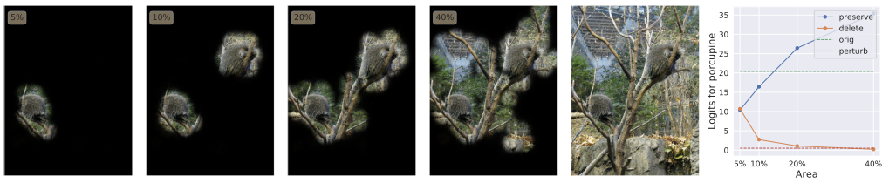

# Details of Torchray

The TorchRay package implements several visualization methods for deep convolutional neural networks using PyTorch. Methods implemented in TorchRay are implemented to solve attribution problems which is determining the most significant features in input for model prediction. The algorithms implemented in the package includes both backpropagation methods (white box methods) and Perturbation methods (black box methods). The specific methods are listed below :

* Backpropagation methods
	* Deconvolution
	* Excitation backpropagation
	* Gradient
	* Grad-CAM
	* Guided backpropagation
	* Linear approximation

* Perturbation methods
	* Extremal perturbation
	* RISE

The the initial aim of TorchRay is to develope and compare Extremal Perturbation method with other Backpropagation methods. Therefore TorchRay not only contains source codes but also provides well encapsulated functions of various visualization methods for performance evaluation. 

* As the core part of TorchRay package Extremal perturbation was investigated in detail.

The [full documents](https://facebookresearch.github.io/TorchRay/attribution.html#module-torchray.attribution.extremal_perturbation), [Source code](https://github.com/facebookresearch/TorchRay/tree/master/torchray/attribution), [Paper](https://arxiv.org/pdf/1910.08485.pdf) of extremal perturbation method can be found in the links.

## Example Output


# Extremal Perturbation

## Theory

The extremal perturbation analysis perturbs the input image by applying an almost-binary mask to it. The applied mask is called almost-binary that the mask preserves image pixels in some regions, i.e. not altering the pixels' RGB values, and blacks all the other pixels with little grey transition area in between. For a given mask area, the extremal perturbation method optimises the mask shape such that the model output with the perturbed input image is maximised for a user-assigned category.

Mathematically, this optimisation process can be expressed as:

,

where _**m**_ is the optimised mask, _a_ is the ratio of the mask's preserving area to the complete image area,  is the neural network,  is the image size, _**M**_ is a set of sufficiently smooth functions, _**x**_ is the image, and  denotes the image perturbed by the mask.



The above figures show the “porcupine” masks computed for several areas, with the classification score of each perturbed images shown in the right.

The detailed theory can be found in this [paper by Fong at el.](https://arxiv.org/abs/1910.08485) and the [TorchRay documentation](https://facebookresearch.github.io/TorchRay/).

## Usage

This section includes an example usage of extremal perturbation method by calling the extremal_purturbation() function under torchray.attribution.extremal_perturbation. The detailed documentation of all the method used can be found in the [TorchRay documentation](https://facebookresearch.github.io/TorchRay/attribution.html#module-torchray.attribution.extremal_perturbation).

```
from torchray.attribution.extremal_perturbation import extremal_perturbation, contrastive_reward
from torchray.benchmark import get_example_data, plot_example
from torchray.utils import get_device

# Obtain example data.
model, x, category_id_1, category_id_2 = get_example_data()

# Run on GPU if available.
device = get_device()
model.to(device)
x = x.to(device)

# Extremal perturbation backprop.
masks_1, _ = extremal_perturbation(
    model, x, category_id_1,
    reward_func=contrastive_reward,
    debug=True,
    areas=[0.12],
)

masks_2, _ = extremal_perturbation(
    model, x, category_id_2,
    reward_func=contrastive_reward,
    debug=True,
    areas=[0.05],
)

# Plots.
plot_example(x, masks_1, 'extremal perturbation', category_id_1)
plot_example(x, masks_2, 'extremal perturbation', category_id_2)
```


# Usage
The simple examples of other methods except Extremal perturbation

### Deconvolution
~~~~
from torchray.attribution.deconvnet import deconvnet
from torchray.benchmark import get_example_data, plot_example

# Obtain example data.
model, x, category_id, _ = get_example_data()

# DeConvNet method.
saliency = deconvnet(model, x, category_id)

# Plots.
plot_example(x, saliency, 'deconvnet', category_id)
~~~~


### Excitation backpropgation
~~~~
from torchray.attribution.excitation_backprop import excitation_backprop
from torchray.benchmark import get_example_data, plot_example

# Obtain example data.
model, x, category_id, _ = get_example_data()

# Contrastive excitation backprop.
saliency = excitation_backprop(
    model,
    x,
    category_id,
    saliency_layer='features.9',
)

# Plots.
plot_example(x, saliency, 'excitation backprop', category_id)
~~~~

### Gradient
~~~~
from torchray.attribution.gradient import gradient
from torchray.benchmark import get_example_data, plot_example

# Obtain example data.
model, x, category_id, _ = get_example_data()

# Gradient method.
saliency = gradient(model, x, category_id)

# Plots.
plot_example(x, saliency, 'gradient', category_id)
~~~~


### Grad_CAM
~~~~
from torchray.attribution.grad_cam import grad_cam
from torchray.benchmark import get_example_data, plot_example

# Obtain example data.
model, x, category_id, _ = get_example_data()

# Grad-CAM backprop.
saliency = grad_cam(model, x, category_id, saliency_layer='features.29')

# Plots.
plot_example(x, saliency, 'grad-cam backprop', category_id)
~~~~


### Guided backprop
~~~~
from torchray.attribution.guided_backprop import guided_backprop
from torchray.benchmark import get_example_data, plot_example

# Obtain example data.
model, x, category_id, _ = get_example_data()

# Guided backprop.
saliency = guided_backprop(model, x, category_id)

# Plots.
plot_example(x, saliency, 'guided backprop', category_id)
~~~~

### Linear approximation
~~~~
from torchray.attribution.linear_approx import linear_approx
from torchray.benchmark import get_example_data, plot_example

# Obtain example data.
model, x, category_id, _ = get_example_data()

# Linear approximation backprop.
saliency = linear_approx(model, x, category_id, saliency_layer='features.29')

# Plots.
plot_example(x, saliency, 'linear approx', category_id)
~~~~

### RISE
~~~~
from torchray.attribution.rise import rise
from torchray.benchmark import get_example_data, plot_example
from torchray.utils import get_device

# Obtain example data.
model, x, category_id, _ = get_example_data()

# Run on GPU if available.
device = get_device()
model.to(device)
x = x.to(device)

# RISE method.
saliency = rise(model, x)
saliency = saliency[:, category_id].unsqueeze(0)

# Plots.
plot_example(x, saliency, 'RISE', category_id)
~~~~


# Installation and Requirements

### Required Packages
* Python 3.4 or greater
* pytorch 1.1.0 or greater
* matplotlib
* torchvision 0.3.0 or greater
* pycocotools
* mongodb (suggested)
* pymongod (suggested)

### Install Requirements (Linux/MacOS)
~~~~
while read requirement; do conda install \
-c defaults -c pytorch -c conda-forge --yes $requirement; done <<EOF
pytorch>=1.1.0
pycocotools
torchvision>=0.3.0
mongodb
pymongo
EOF
~~~~

### Install TorchRay
~~~~
pip install torchray
~~~~