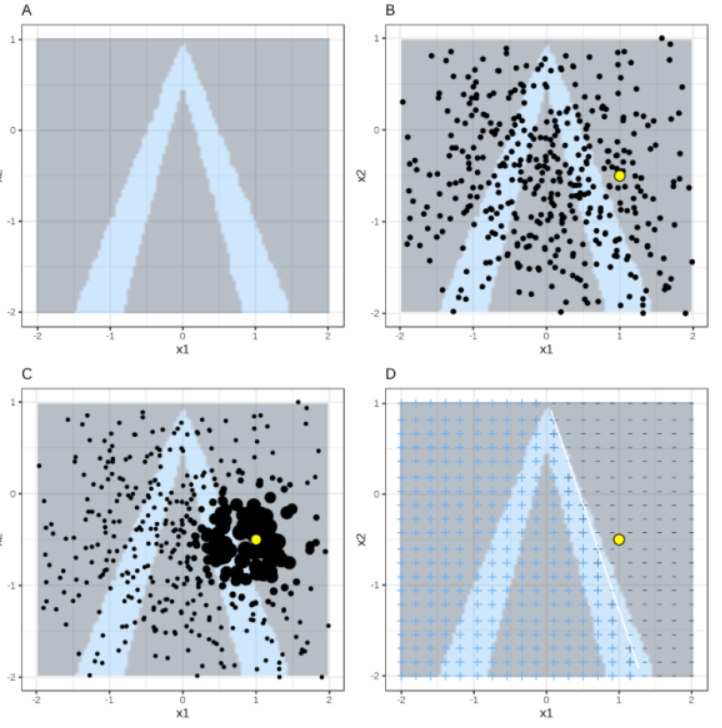

# Modifications by this project

LIME has been adapted in this project to support explanations for multimodal (visual and language) binary classification. See /lime.

# Details of LIME

LIME(Local Interpretable Model-Agnostic) is a model-agnostic method to explain any classification model. It explains one individual prediction a time in a human-readable way, illustrating what affects the model's decision. The basic methodology is to generate a new dataset consisting of some perturbed data around the input and train a simple linear model against the class of interest to obtain the same or similar results to the original model.

This directory contains a detailed review of LIME and how to use it, sourced from [LIME paper](https://arxiv.org/abs/1602.04938), [tutorials, and source code](https://github.com/marcotcr/lime). Source codes for image classification are presented here with extra comments.

# How it works

### Local Explanation of a classification model - individual instance:

This part corresponds to Section 3 of the paper

When **a single input** is passed into a **classification model**, the model outputs the **predicted classes** with corresponding **probabilities**. With lime, the user can inspect which parts of the input most encourage or discourage the prediction of one class.

LIME will give a local explanation by: 

1) take such one model, one input instance, top N predicted classes specified by the user, 

2) randomly perturb the input to generate a set of variations, with features changed to the forms interpretable to humans (eg. from flattened numerical pixel values to super-pixels for image)

3) compute the distance, thus a proximity measure between each variation and the original input,

4) fits N simple linear regression models that each simulates how the user classification model computes the probability to a specified class around the locality of the input instance (the variations, weighted by proximity measure), 

5) From the weight matrix of such local linear model, find the weights with the largest (the most negative) value. The corresponding interpretable features of the weights will be the ones that most encourage (discourage) the prediction of the class,

6) Visualise these features

#### An example 

Figure A shows a classification model, blue and grey regions are the decision boundary. LIME can be used to explain the classification of the yellow point in Figure B. The above is step **1)**. The little black dots in Figure B are the newly generated perturbed data, corresponding to step **2)**. Moving on to Figure C, step **3)** is performed. The area of the black dots denotes the proximity measure (how much each data point weight when learning the linear model). Then, by default, a Ridge linear model in sklearn package is learned (step **4**), this is the white line in Figure D. By examining the parameters of the linear model, an explanation can be generated.

# Source Code

### Code Structure for Image Classification

#### The 3 key classes and key functions (This is some high-level understandings of the codes, the detailed parameters / returns are clearly stated in the python files with comments / [API doc](https://lime-ml.readthedocs.io/en/latest/)):

 1. lime_base.py, class **LimeBase**, **explain_instance_with_data( )**:
 
 Class / function for learning one local linear regression model (the whole model is the output) from perturbed data and labels
  
 Preparation for fitting the linear model:
 
 1) transfer distance to proximity measures
 
 2) get the vector containing predicted probability of the one desired class for each perturbed data
 
 3) select features (super-pixels) from perturbed data to fit the linear model -----> **feature_selection( )**

 Learning linear model, default using [sklearn.linear_model.Ridge](https://scikit-learn.org/stable/modules/generated/sklearn.linear_model.Ridge.html)
  
  
 2. lime_image.py, class **LimeImageExplainer**, **explain_instance( )**:
 
 Class / function for taking in the input image and the user model, 
 
 create segmentations (super-pixels) of the image, -----> **quickshift algorithm in skimage.segmentation**
 
 generate perturbed images and labels predicted by user model (here the features are changed from flattened image pixels to super-pixels) -----> **data_labels( )**
 
 calculate distance between perturbed images and the input, -----> **kernel_fn = partial(kernel, kernel_width=kernel_width)**
 
 for each labels need to be explained, generate local linear model, -----> **LimeBase.explain_instance_with_data( )**
 
 store the information of linear models to a **ImageExplanation** class object, see the followings:
 
 
 3. lime_image.py, class **ImageExplanation**, **get_image_and_mask( )**:
 
 Class / function for providing interpretable visualisations for a prediction of a specified class. Returns the input image and desired masks (super-pixels) based on how the user wants the explanation.
 

The output format for other data modals (tabular, texts) can be found in **Explanation.py** including: **as_list, as_map, as_pyplot_figure** and so on.

# [How to Use It](https://github.com/marcotcr/lime/blob/master/doc/notebooks/Tutorial%20-%20images%20-%20Pytorch.ipynb)

suppose user has an image and a classification model, first define two functions: 1). **transfer( )** that transfers image to numpy array, 2). ****classification function( )*** that would take array of perturbed images as input and produce the probabilities for each class for each image as output.

    from lime import lime_image
    from skimage.segmentation import mark_boundaries
    
    explainer = lime_image.LimeImageExplainer()
    explanation = explainer.explain_instance(np.array(transfer(img)), 
                                         classification, # classification function
                                         top_labels=5, 
                                         hide_color=0, 
                                         num_samples=1000) # number of the perturbed images
    
    # get the super-pixels that encourages the most possible class
    temp, mask = explanation.get_image_and_mask(explanation.top_labels[0], positive_only=True, num_features=5, hide_rest=False)
    
    img_boundry1 = mark_boundaries(temp/255.0, mask)
    plt.imshow(img_boundry1)
    

**depending on how the model is architectured, (e.g. whether it performs normalisation), may need access to the mean and standard deviation value of training dataset*

### Dependencies

 - lime (pip install lime)

 - numpy

 - scipy

 - sklearn
 
 - PIL

 - tqdm

 - Also install relevant deep learning package, eg. pyTorch.
 
